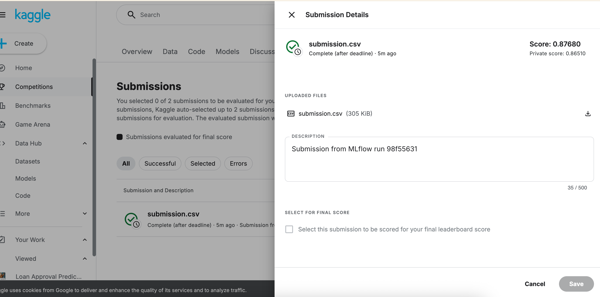
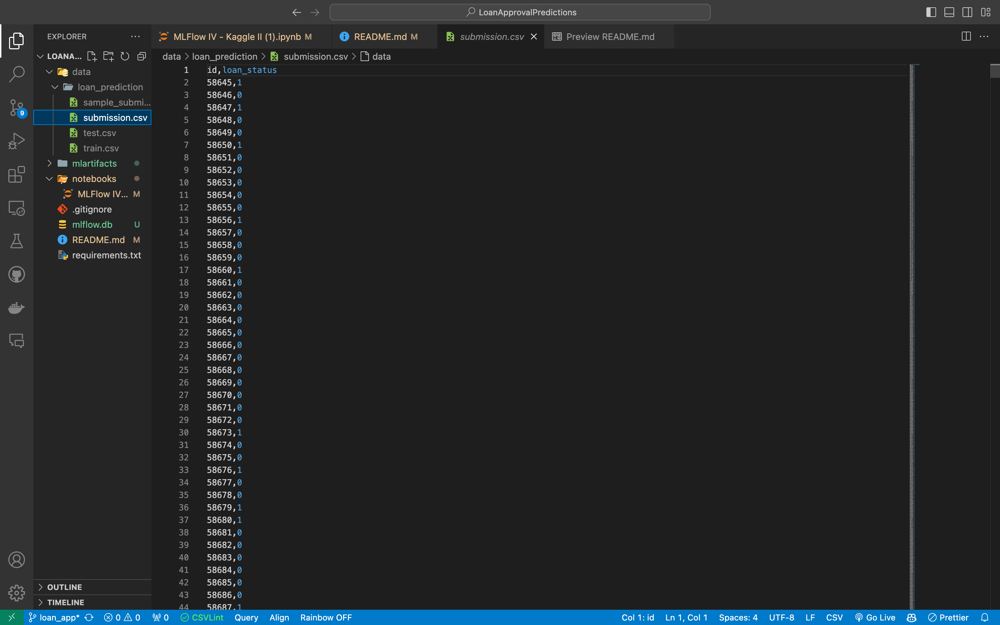
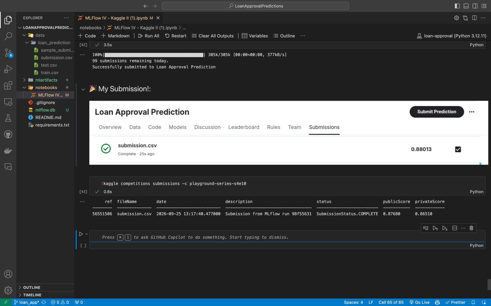

# 💳 Loan Approval Predictions

End-to-end Machine Learning project for loan approval prediction using **Scikit-learn, MLflow, Docker, FastAPI and Kaggle**.

The project covers the complete workflow from data exploration and model training to experiment tracking, Kaggle submission and model deployment as a REST API.

---

## 👨‍💻 Author

**Fabian R. M.**

Machine Learning & Data Science Project

* GitHub: [LoanApprovalPredictions](https://github.com/fabianrmro/LoanApprovalPredictions)
* Kaggle Competition: [Loan Approval Prediction — Playground Series S4E10](https://www.kaggle.com/competitions/playground-series-s4e10)

---

## 📌 About the Project

This project was developed using the **Loan Approval Prediction** Kaggle competition from the Playground Series.

The objective is to build a binary classification model for the `loan_status` target variable and develop a reproducible Machine Learning workflow around it.

The project includes:

* Exploratory Data Analysis
* Data preprocessing
* Feature preparation
* Random Forest classification
* Model evaluation
* Classification threshold optimization
* MLflow experiment tracking
* Model and artifact logging
* Kaggle submission generation
* Docker containerization
* FastAPI model serving
* Prediction through a REST API

---

## 🎯 Objectives

The main objectives of the project are:

1. Explore and understand the loan application dataset.
2. Build a preprocessing and Machine Learning pipeline.
3. Train a Random Forest classification model.
4. Evaluate model performance using ROC AUC and threshold-related metrics.
5. Optimize the classification threshold using `TunedThresholdClassifierCV`.
6. Track experiments and artifacts with MLflow.
7. Generate and submit predictions to Kaggle.
8. Deploy the trained model as an API using Docker and FastAPI.
9. Serve the model from MLflow and expose predictions through an HTTP endpoint.

---

## 🧠 Machine Learning Workflow

The project follows this workflow:

```text
Dataset
   │
   ▼
Exploratory Data Analysis
   │
   ▼
Data Preprocessing
   │
   ▼
Random Forest
   │
   ▼
Model Evaluation
   │
   ▼
Threshold Optimization
   │
   ▼
MLflow Experiment Tracking
   │
   ├── Model
   └── submission.csv
   │
   ▼
Kaggle Submission
   │
   ▼
Docker + FastAPI Deployment
   │
   ▼
REST API Prediction
```

---

## 📊 Dataset

The project uses the dataset provided by the Kaggle competition.

Current dataset sizes:

| Dataset       |   Rows |
| ------------- | -----: |
| Training data | 58,645 |
| Test data     | 39,098 |
| Submission    | 39,098 |

The training data contains the target variable:

```text
loan_status
```

with binary values:

```text
0
1
```

The generated submission contains:

```text
id
loan_status
```

The dataset and submission files are available under:

```text
data/loan_prediction/
```

---

## 🤖 Machine Learning Model

The main classifier is a:

### Random Forest Classifier

The model is implemented together with a Scikit-learn preprocessing pipeline.

Numerical features are standardized using `StandardScaler`, while categorical features are encoded using `OneHotEncoder`.

The resulting preprocessing and model components are combined in a Scikit-learn `Pipeline`.

The project also uses:

```text
TunedThresholdClassifierCV
```

to evaluate classification thresholds instead of relying exclusively on the default threshold of `0.5`.

---

## 🎚️ Threshold Optimization

The classification threshold determines how predicted probabilities are converted into binary classes.

The project evaluates threshold-related metrics including:

* ROC AUC
* False Positive Rate
* True Positive Rate

The selected MLflow experiment recorded the following threshold:

```text
Optimal threshold: 0.19192
```

The experiment also recorded the metrics associated with the selected threshold and the default threshold.

---

## 📈 Model Results

The selected MLflow run recorded the following metrics:

| Metric                  |   Value |
| ----------------------- | ------: |
| AUC                     | 0.86998 |
| Optimal Threshold       | 0.19192 |
| FPR — Optimal Threshold | 0.06394 |
| TPR — Optimal Threshold | 0.80390 |
| Average Threshold       | 0.50000 |
| FPR — Average Threshold | 0.01081 |
| TPR — Average Threshold | 0.72107 |

These values correspond to the MLflow experiment run documented in the project notebook.

---

## 🧪 MLflow Experiment Tracking

MLflow is used to track the Machine Learning experiment, metrics, model and generated artifacts.

### Experiment

```text
loan_prediction
```

### Recorded run

```text
Run ID:
98f55631a65a4debbe89554df326f102
```

```text
Run Name:
ambitious-deer-694
```

The experiment records:

* Model information
* Evaluation metrics
* Classification threshold metrics
* Model artifacts
* Kaggle submission artifacts

---

## 📦 MLflow Artifacts

The MLflow run includes the generated:

```text
submission.csv
```

The submission artifact contains:

```text
Shape: (39098, 2)

Columns:
- id
- loan_status
```

The artifact was downloaded from MLflow and used for the Kaggle submission.

---

## 🏆 Kaggle Submission

The generated submission was uploaded to:

**Loan Approval Prediction — Playground Series S4E10**

[Kaggle Competition](https://www.kaggle.com/competitions/playground-series-s4e10)

The Kaggle CLI was used to submit the generated prediction file:

```bash
kaggle competitions submit \
    -c playground-series-s4e10 \
    -f submission.csv \
    -m "Submission from MLflow run 98f55631"
```

A screenshot of the Kaggle result is available in:

```text
Screenshot/Kaggle.png
```

---

## 🐳 Docker Deployment

The trained model is deployed as a REST API using Docker and FastAPI.

The deployment architecture is:

```text
MLflow Tracking Server
        │
        │ model
        ▼
Docker Container
        │
        ▼
FastAPI
        │
        ├── GET /
        │
        └── POST /predict
```

The Docker container loads the model from MLflow using the `MODEL_URI` environment variable.

---

## 🚀 Dockerfile

The project contains a `Dockerfile` in the repository root.

The image can be built with:

```bash
docker build -t loan-approval-api .
```

---

## 🧪 Start MLflow

The local MLflow Tracking Server uses the SQLite backend stored in:

```text
mlflow.db
```

Start MLflow with:

```bash
mlflow server \
    --host 0.0.0.0 \
    --port 5001 \
    --backend-store-uri sqlite:///mlflow.db \
    --serve-artifacts \
    --allowed-hosts "*"
```

The MLflow interface will then be available at:

```text
http://127.0.0.1:5001
```

The `5001` port is used because port `5000` may already be occupied by another macOS service.

The notebook configures MLflow with:

```python
import mlflow

mlflow.set_tracking_uri("http://127.0.0.1:5001")
mlflow.set_experiment("loan_prediction")
```

---

## 📡 Run the Docker Container

Once the MLflow server is running, start the API container with:

```bash
docker run --rm -d \
    -p 8000:8000 \
    -e MLFLOW_TRACKING_URI=http://host.docker.internal:5001 \
    -e MODEL_URI=models:/m-5f6d82857fa142349e24023bfc55b5e2 \
    loan-approval-api
```

The API will be available at:

```text
http://127.0.0.1:8000
```

---

## 🔍 Verify the API

The root endpoint can be tested with:

```bash
curl http://127.0.0.1:8000/
```

A successful response is similar to:

```json
{
  "message": "Loan Approval Prediction API is running",
  "model_uri": "models:/m-5f6d82857fa142349e24023bfc55b5e2"
}
```

---

## 🔮 Prediction Endpoint

The deployed model exposes:

```text
POST /predict
```

Example request:

```bash
curl -X POST http://127.0.0.1:8000/predict \
  -H "Content-Type: application/json" \
  -d '{
    "person_age": 30,
    "person_income": 50000,
    "person_home_ownership": "RENT",
    "person_emp_length": 5,
    "loan_intent": "PERSONAL",
    "loan_grade": "B",
    "loan_amnt": 10000,
    "loan_int_rate": 10.5,
    "loan_percent_income": 0.20,
    "cb_person_default_on_file": "N",
    "cb_person_cred_hist_length": 8
  }'
```

The deployed API returns:

```json
{
  "prediction": 0
}
```

The same prediction is demonstrated in the project notebook using a Python HTTP request.

---

## 📓 Notebook

The complete workflow is documented in:

```text
notebooks/MLFlow IV - Kaggle II (1).ipynb
```

The notebook contains:

1. Data collection
2. Data exploration
3. Exploratory Data Analysis
4. Data preprocessing
5. Model selection
6. Model training
7. Model evaluation
8. Threshold optimization
9. MLflow experiment tracking
10. Kaggle submission
11. Docker and MLflow deployment
12. Prediction using the deployed API

The deployment section documents:

* Docker image creation
* Docker container execution
* MLflow model retrieval
* API verification
* Prediction through `/predict`
* Interpretation of the returned prediction

---

## 🛠️ Technologies Used

| Technology    | Purpose                               |
| ------------- | ------------------------------------- |
| Python 3.12   | Programming language                  |
| Pandas        | Data manipulation                     |
| NumPy         | Numerical computation                 |
| Scikit-learn  | Machine Learning                      |
| Random Forest | Classification                        |
| Matplotlib    | Data visualization                    |
| Seaborn       | Data visualization                    |
| MLflow        | Experiment tracking and model serving |
| FastAPI       | REST API                              |
| Uvicorn       | API server                            |
| Docker        | Containerization                      |
| Kaggle CLI    | Competition submission                |
| Jupyter       | Notebook environment                  |
| Git           | Version control                       |
| GitHub        | Repository hosting                    |

---

## 📂 Project Structure

```text
LoanApprovalPredictions/
│
├── data/
│   └── loan_prediction/
│       ├── sample_submission.csv
│       ├── submission.csv
│       ├── test.csv
│       └── train.csv
│
├── notebooks/
│   └── MLFlow IV - Kaggle II (1).ipynb
│
├── Screenshot/
│   ├── Kaggle.png
│   ├── loanApprovalPrediction.png
│   └── Submission.png
│
├── app.py
├── Dockerfile
├── mlflow.db
├── requirements.txt
└── README.md
```

---

## ⚙️ Installation

### 1. Clone the repository

```bash
git clone https://github.com/fabianrmro/LoanApprovalPredictions.git
cd LoanApprovalPredictions
```

### 2. Create the Conda environment

```bash
conda create -n loan-approval python=3.12 -y
```

Activate it:

```bash
conda activate loan-approval
```

### 3. Install dependencies

```bash
pip install -r requirements.txt
```

### 4. Launch Jupyter

```bash
jupyter notebook
```

Open:

```text
notebooks/MLFlow IV - Kaggle II (1).ipynb
```

---

## 📊 Screenshots

### Kaggle



### Kaggle Submission



### Project / Notebook



---

## 🔄 Reproducibility

A complete reproduction of the project follows these main steps:

```text
1. Clone repository
2. Create Conda environment
3. Install requirements
4. Start MLflow
5. Open the notebook
6. Run the Machine Learning workflow
7. Generate submission.csv
8. Log the experiment and model to MLflow
9. Build the Docker image
10. Start the Docker container
11. Call the /predict endpoint
12. Submit the prediction file to Kaggle
```

---

## 📌 Final Result

The project implements a complete Machine Learning and MLOps workflow:

* ✅ Dataset processed
* ✅ Exploratory analysis performed
* ✅ Machine Learning pipeline created
* ✅ Random Forest model trained
* ✅ Threshold optimization performed
* ✅ Metrics tracked with MLflow
* ✅ Model logged to MLflow
* ✅ Submission artifact generated
* ✅ Kaggle submission completed
* ✅ Docker image created
* ✅ FastAPI application deployed
* ✅ MLflow model served through Docker
* ✅ REST prediction endpoint tested successfully

---

## 👨‍💻 About the Author

**Fabian Romero**

Machine Learning & Data Science

GitHub: [LoanApprovalPredictions](https://github.com/fabianrmro/LoanApprovalPredictions)

---

⭐ Thanks for visiting the project! ⭐
